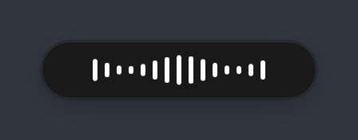
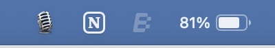

# FlowLocal 🎙

Private, on-device voice dictation for macOS and Windows. Hold a hotkey, speak, release — polished text lands in whatever app you're in.

A local, open-source alternative to Wispr Flow: **zero network calls, zero subscription, free forever**. Your voice never leaves your Mac.

<table align="center">
  <tr>
    <td align="center"></td>
    <td align="center"></td>
  </tr>
  <tr>
    <td align="center"><em>Hold the hotkey and speak — live waveform</em></td>
    <td align="center"><em>Release — transcribing, then it pastes</em></td>
  </tr>
</table>

## How it works

```
hold hotkey → mic capture → Whisper (MLX, on-GPU) → LLM cleanup (Ollama, local)
                                                       → paste into frontmost app
```

- **Transcription:** `whisper-large-v3-turbo`. On macOS via [mlx-whisper](https://github.com/ml-explore/mlx-examples) (Apple Silicon GPU, ~0.5s for a typical utterance); on Windows via [faster-whisper](https://github.com/SYSTRAN/faster-whisper) (NVIDIA GPU when available, quantized CPU otherwise).
- **Cleanup:** `llama3.2:3b` via [Ollama](https://ollama.com) strips fillers ("um", "uh"), fixes punctuation, applies spoken self-corrections ("no wait, actually Friday" → "Friday"), and adapts tone to the frontmost app (formal in Mail, casual in Slack, verbatim-technical in editors/terminals). If Ollama isn't running, a regex fallback strips fillers so dictation always works.
- **Injection:** text is pasted via a synthesized ⌘V; your previous clipboard is restored afterward.
- **UI:** a Wispr-style pill at the bottom of the screen shows a live waveform while you speak.

The only network access, ever, is the one-time model download.

## Requirements

- **macOS:** Apple Silicon Mac (M1 or later — MLX runs on the Apple GPU)
- **Windows:** Windows 10/11; an NVIDIA GPU makes transcription near-instant, but CPU works too (a few seconds per utterance — set `"model": "small"` in config if that's too slow)
- [uv](https://docs.astral.sh/uv/) on either platform
- [Ollama](https://ollama.com) — optional, for AI cleanup

## Install (macOS)

```bash
git clone https://github.com/blakeschafer/flowlocal.git
cd flowlocal
./scripts/install.sh
```

The installer sets up the Python environment, pulls the cleanup model if Ollama is present, and registers a LaunchAgent so FlowLocal **starts at every login and restarts if it crashes** — install once, never think about it again.

A 🎙 appears in the menu bar (⏳ while the Whisper model downloads — first run only, ~1.6GB):



### One-time permissions

macOS will ask for three permissions (System Settings → Privacy & Security):

1. **Microphone** — allow when prompted on first dictation
2. **Input Monitoring** — add the Python binary FlowLocal runs under
3. **Accessibility** — same binary (needed to synthesize the ⌘V paste)

The binary to grant is the target of `readlink -f .venv/bin/python3`. After granting, restart FlowLocal: `launchctl kickstart -k gui/$(id -u)/com.flowlocal`.

> Prefer to run it manually instead of always-on? Skip the installer and use `uv sync && uv run flowlocal`.

## Install (Windows)

```powershell
git clone https://github.com/blakeschafer/flowlocal.git
cd flowlocal
powershell -ExecutionPolicy Bypass -File scripts\install.ps1
```

The installer sets up the Python environment, pulls the cleanup model if Ollama is present, registers FlowLocal to **start at login**, and launches it. A mic icon appears in the system tray (gray while the Whisper model downloads — first run only).

If dictation stays silent, allow microphone access under Settings → Privacy & security → Microphone → "Let desktop apps access your microphone".

> **Note:** the Windows port is new and I develop on macOS — it follows the same pipeline but has had less real-world mileage. Bug reports and PRs are very welcome.

## Usage

| Action | Gesture |
|---|---|
| Dictate | **Hold Right-Option** (macOS) / **Right-Ctrl** (Windows), speak, release |
| Hands-free | **Double-tap** the hotkey, speak freely, tap once to finish |
| Toggle AI cleanup | Menu bar / tray icon → "AI Cleanup (Ollama)" |

macOS menu bar states: 🎙 idle · 🔴 recording · ✍️ transcribing · ⚠️ model failed to load. On Windows the tray mic changes color: white idle · red recording · yellow transcribing.

## Configuration

`~/.flowlocal/config.json` (created on first settings change; all keys optional):

```json
{
  "hotkey": "alt_r",
  "model": "mlx-community/whisper-large-v3-turbo",
  "language": null,
  "cleanup": {
    "enabled": true,
    "ollama_model": "llama3.2:3b",
    "per_app_tone": true
  }
}
```

- `hotkey`: any [pynput key name](https://pynput.readthedocs.io/en/latest/keyboard.html#pynput.keyboard.Key) — `alt_r`, `cmd_r`, `ctrl_r`, `f13`… (defaults: `alt_r` on macOS, `ctrl_r` on Windows)
- `model`: macOS — any mlx-community Whisper repo; Windows — any faster-whisper model name (`large-v3-turbo`, `small`…). Smaller models are faster, `large-v3-turbo` most accurate.
- `language`: `"en"` locks English and speeds decoding; `null` autodetects.

After changing config, restart FlowLocal — macOS: `launchctl kickstart -k gui/$(id -u)/com.flowlocal`; Windows: quit from the tray icon and relaunch `.venv\Scripts\flowlocalw.exe`.

## Uninstall

```bash
./scripts/uninstall.sh    # macOS: stops the service and removes the LaunchAgent
```

```powershell
powershell -ExecutionPolicy Bypass -File scripts\uninstall.ps1   # Windows
```

## Development

```bash
uv run pytest    # includes a real end-to-end Whisper test using macOS `say`
```

Logs live at `/tmp/flowlocal.log` and `/tmp/flowlocal.err`.

## License

[MIT](LICENSE)
